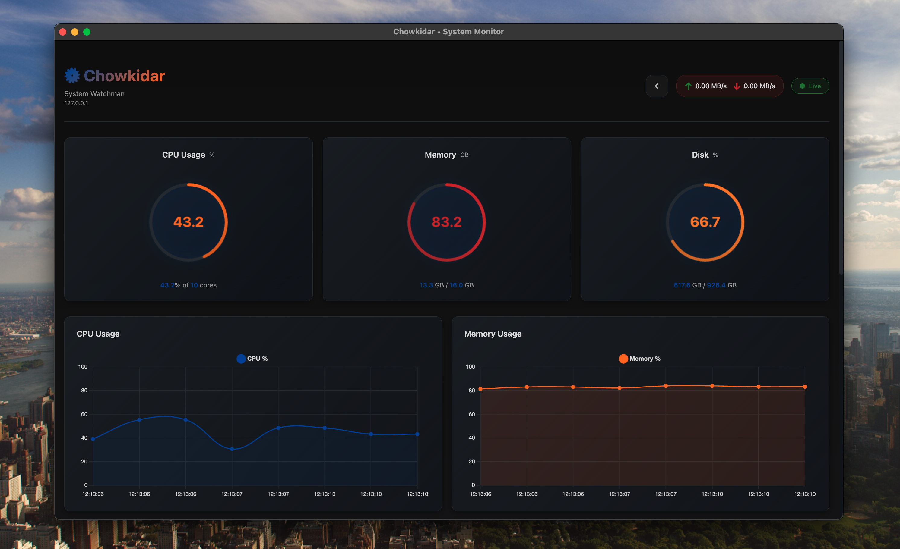

# Chowkidar

<div style="margin: 24px 0 32px; padding: 24px; background: #1f2230; border-radius: 18px;">
	<h2 style="margin: 0 0 10px;">System Monitoring, Beautifully Packaged</h2>
	<p style="margin: 0; color: #c9cbd4;">Desktop GUI + lightweight agents for servers everywhere.</p>
</div>



## Install

### Agent (single curl command)

```bash
curl -fsSL https://raw.githubusercontent.com/ahsantahseen/Chowkidar/main/scripts/install-agent.sh | bash
```

Run it:

```bash
chowkidar-agent
```

### Desktop GUI

**macOS**

```bash
curl -fsSL https://raw.githubusercontent.com/ahsantahseen/Chowkidar/main/scripts/install-client-macos.sh | bash
```

**Windows (PowerShell)**

```powershell
iwr -useb https://raw.githubusercontent.com/ahsantahseen/Chowkidar/main/scripts/install-client-windows.ps1 | iex
```

**Linux**

```bash
curl -fsSL https://raw.githubusercontent.com/ahsantahseen/Chowkidar/main/scripts/install-client-linux.sh | bash
```

## Connect the GUI

Set the backend URL in the desktop app when prompted or via `desktop/config.json`.

## Token

Generate a token from the agent host:

```bash
curl http://localhost:8080/auth/token
```

## Screenshots


## Support

Open an issue in the repository for bugs and feature requests.
